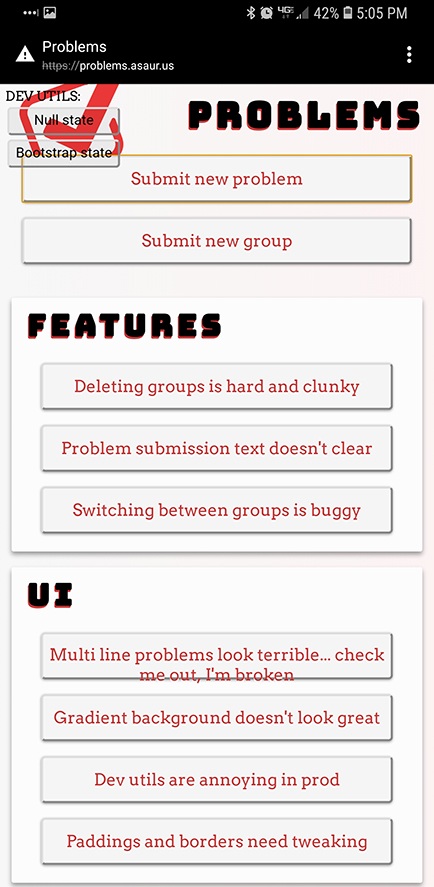

# Problems

The TODO app for problem solvers.

The app is best used as a progressive web app. Save the website to your device's home screen for best results.

Currently deployed to:
  - Direct to cloudfront: https://d16y8ndu9ne88s.cloudfront.net/
  - Future URL (Subdomain not yet added to SSL cert): https://problems.asaur.us/

## Dev Setup

**Development**: Run `yarn` followed by `yarn start` to start dev server.
Commits that are not deployment-ready should be deployed to a feature branch.
[Create React App](https://github.com/facebook/create-react-app) documentation should be referenced for further questions.

**Deployment**: The master branch is automatically built and deployed to s3. No manual deployment is required.